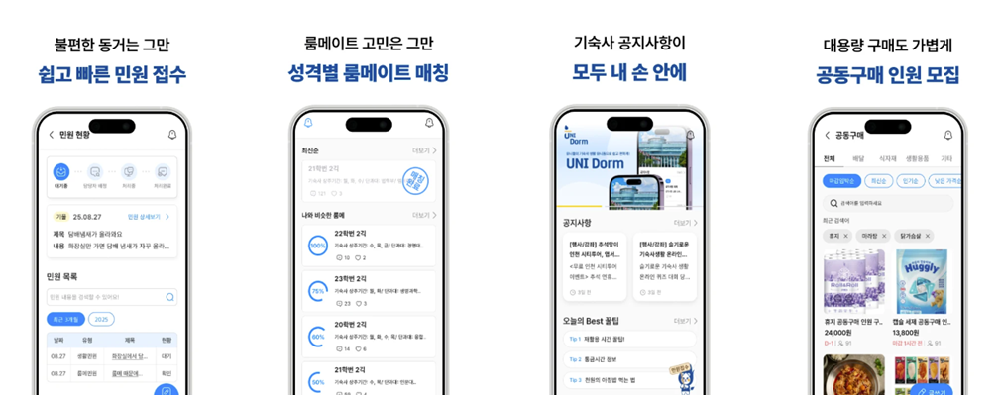
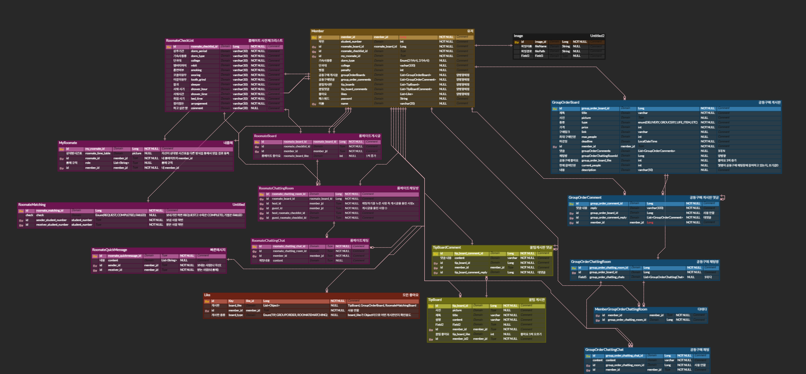
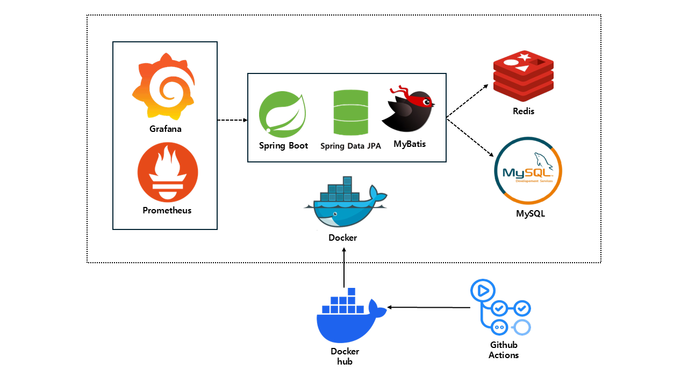

# 기숙사에서의 삶을 편리하게 UniDorm

## 인천대학교 기숙사 통합 앱/웹 서비스

---

- IOS 앱스토어 : https://apps.apple.com/kr/app/%EC%9C%A0%EB%8B%88%EB%8F%94/id6751404748
- 안드로이드 플레이 스토어 : https://play.google.com/store/search?q=%EC%9C%A0%EB%8B%88%EB%8F%94&c=apps&hl=ko
- 웹 주소 : https://unidorm.inuappcenter.kr/
- 개발기간 : 2025.03 ~ ing

## 🎯 주요 기능

### 핵심 서비스

- **공지사항 자동 수집**: Selenium 웹 크롤링으로 기숙사 공지사항 자동 수집 및 푸시 알림 (하루 3회)
- **룸메이트 매칭**: 생활 패턴 체크리스트 기반 매칭 및 1:1 채팅
- **공동구매**: 카테고리별 공동구매 게시판 및 그룹 채팅
- **민원 관리**: 시설 고장, 분실물 등 민원 접수 및 처리 시스템
- **알림 시스템**: Firebase FCM 기반 실시간 푸시 알림
- **팁 게시판**: 기숙사 생활 팁 공유 커뮤니티
- **수업신청**: 자치회/기숙사 수업 신청 
- **캘린더**: 기숙사 주요 일정 관리

### 주요 특징

- **실시간 통신**: WebSocket (STOMP) 기반 채팅 시스템
- **멀티 데이터소스**: MySQL (메인 DB) + Oracle (학교 DB) + Redis (캐시)
- **JWT 인증**: Access Token + Refresh Token
- **역할 기반 접근 제어**: USER, ADMIN, DORMITORY 권한 관리
- **Docker 배포**: Docker + GitHub Actions CI/CD

## 팀원 목록

---
<table>
  <tbody>
    <tr>
      <td align="center"><a href=""> <b>김동현</b></a> </td>
      <td align="center"><a href=""> <b>김지민</b></a> </td>
  </tbody>
</table>

## ERD

---

## 시스템 아키텍처

---

## 주요 진행사항

---
1. AOP + MDC 기반 로그 추적 시스템 구축
2. 코드 리팩토링 및 유지보수성 개선
3. LongAdder 및 Scheduler 기반 공동구매 동시성 제어
4. IN, Map을 이용한 게시글 이미지 조회 쿼리 최적화
