# UniDorm - 기숙사에서의 삶을 편리하게

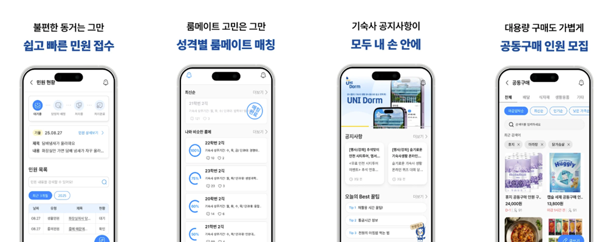

> 인천대학교 기숙사 통합 앱/웹 서비스

[](https://spring.io/projects/spring-boot)
[](https://openjdk.org/)
[](https://www.mysql.com/)
[](https://redis.io/)

- **iOS App Store**: https://apps.apple.com/kr/app/%EC%9C%A0%EB%8B%88%EB%8F%94/id6751404748
- **Android Play Store**: https://play.google.com/store/search?q=%EC%9C%A0%EB%8B%88%EB%8F%94&c=apps&hl=ko
- **Web**: https://unidorm.inuappcenter.kr/
- **Monitoring**: https://github.com/Teach-D/unidorm-monitoring
- **개발 기간**: 2025.03 ~

---

## 목차

1. [프로젝트 개요](#1-프로젝트-개요)
2. [기술 스택](#2-기술-스택)
3. [시스템 아키텍처](#3-시스템-아키텍처)
4. [도메인 구조 및 ERD](#4-도메인-구조-및-erd)
5. [주요 기능 및 데이터 흐름](#5-주요-기능-및-데이터-흐름)
6. [인프라 및 배포](#6-인프라-및-배포)
7. [주요 성과 및 해결 사례](#7-주요-성과-및-해결-사례)
8. [팀원](#8-팀원)

---

## 1. 프로젝트 개요

UniDorm은 인천대학교 기숙사생을 위한 통합 플랫폼입니다. 기숙사 공지사항 자동 수집부터 룸메이트 매칭, 공동구매, 민원 처리까지 기숙사 생활에 필요한 모든 기능을 하나의 앱에서 제공합니다.

### 핵심 서비스

| 서비스 | 설명 |
|--------|------|
| **공지사항** | Selenium 크롤링으로 기숙사 공지 자동 수집 + 수동 작성, 하루 3회 푸시 알림 |
| **룸메이트 매칭** | 생활 패턴 체크리스트(13개 항목) 기반 유사도 매칭 + WebSocket 1:1 채팅 |
| **공동구매** | 카테고리별 모집 게시판 + 그룹 채팅방 + 평점 시스템 |
| **민원 관리** | 시설 고장/분실물 민원 접수, 담당자 답변, 상태 추적 |
| **알림 시스템** | FCM 푸시 알림 + Outbox 패턴 기반 재시도 |
| **팁 게시판** | 기숙사 생활 팁 공유 + 계층형 댓글 |
| **학사 캘린더** | 기숙사 주요 일정 관리 |
| **설문조사** | 만족도 조사 + CSV 내보내기 |

---

## 2. 기술 스택

### Backend
| 분류 | 기술 |
|------|------|
| Framework | Spring Boot 3.4.4, Spring Security, Spring Data JPA |
| Language | Java 17 |
| ORM | Hibernate 6, QueryDSL 5.0.0, MyBatis 3.0.3 |
| DB | MySQL 8.0 (Primary), Oracle 21c (학교 DB), Redis 7.0 (캐시) |
| Auth | JWT (Access: 24h, Refresh: 30일) |
| 실시간 | WebSocket (STOMP), Firebase FCM |
| 크롤링 | Selenium Java 4.15.0 |
| 탄력성 | Resilience4j (Circuit Breaker), Redisson (분산 락) |
| 캐싱 | Redis, Caffeine (로컬 캐시 폴백) |
| 문서 | SpringDoc OpenAPI 2.7.0 (Swagger) |
| 모니터링 | Spring Actuator, Prometheus, P6Spy (SQL 로깅) |

### Infrastructure
| 분류 | 기술 |
|------|------|
| CI/CD | GitHub Actions |
| Container | Docker, Docker Hub |
| Cloud | 학교 서버 (SSH 배포) |

---

## 3. 시스템 아키텍처

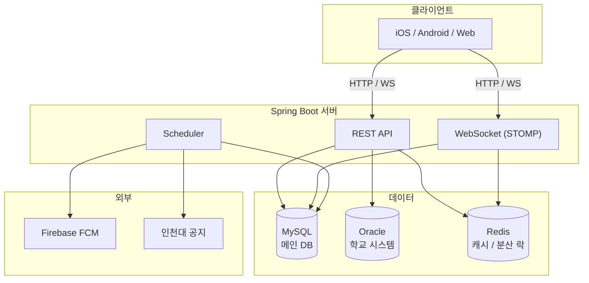
```mermaid
graph TB
    subgraph Client["클라이언트"]
        App["iOS / Android / Web"]
    end

    subgraph Server["Spring Boot 서버"]
        API["REST API"]
        WS["WebSocket (STOMP)"]
        SCHED["Scheduler"]
    end

    subgraph Data["데이터"]
        MySQL[("MySQL\n메인 DB")]
        Oracle[("Oracle\n학교 시스템")]
        Redis[("Redis\n캐시 / 분산 락")]
    end

    subgraph External["외부"]
        FCM["Firebase FCM"]
        Crawl["인천대 공지"]
    end

    App -->|"HTTP / WS"| API & WS
    API & WS --> MySQL & Redis
    API --> Oracle
    SCHED --> MySQL
    SCHED --> FCM
    SCHED --> Crawl
```

---

## 4. 도메인 구조 및 ERD

### 주요 ERD (요약)

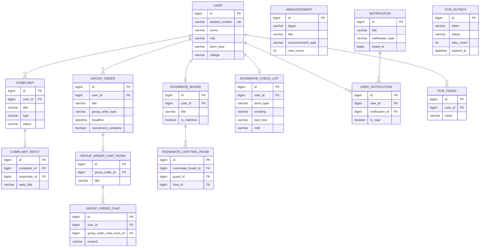
```mermaid
erDiagram
    USER {
        bigint id PK
        varchar student_number UK
        varchar name
        varchar role
        varchar dorm_type
        varchar college
    }

    COMPLAINT {
        bigint id PK
        bigint user_id FK
        varchar title
        varchar type
        varchar status
    }

    COMPLAINT_REPLY {
        bigint id PK
        bigint complaint_id FK
        bigint responder_id FK
        varchar reply_title
    }

    ANNOUNCEMENT {
        bigint id PK
        varchar dtype
        varchar title
        varchar announcement_type
        int view_count
    }

    GROUP_ORDER {
        bigint id PK
        bigint user_id FK
        varchar title
        varchar group_order_type
        datetime deadline
        boolean recruitment_complete
    }

    GROUP_ORDER_CHAT_ROOM {
        bigint id PK
        bigint group_order_id FK
        varchar title
    }

    GROUP_ORDER_CHAT {
        bigint id PK
        bigint user_id FK
        bigint group_order_chat_room_id FK
        varchar content
    }

    ROOMMATE_BOARD {
        bigint id PK
        bigint user_id FK
        varchar title
        boolean is_matched
    }

    ROOMMATE_CHECK_LIST {
        bigint id PK
        bigint user_id FK
        varchar dorm_type
        varchar smoking
        varchar bed_time
        varchar mbti
    }

    ROOMMATE_CHATTING_ROOM {
        bigint id PK
        bigint roommate_board_id FK
        bigint guest_id FK
        bigint host_id FK
    }

    NOTIFICATION {
        bigint id PK
        varchar title
        varchar notification_type
        bigint board_id
    }

    USER_NOTIFICATION {
        bigint id PK
        bigint user_id FK
        bigint notification_id FK
        boolean is_read
    }

    FCM_TOKEN {
        bigint id PK
        bigint user_id FK
        varchar token
    }

    FCM_OUTBOX {
        bigint id PK
        varchar token
        varchar status
        int retry_count
        datetime expired_at
    }

    USER ||--o{ COMPLAINT : ""
    USER ||--o{ GROUP_ORDER : ""
    USER ||--o| ROOMMATE_BOARD : ""
    USER ||--o| ROOMMATE_CHECK_LIST : ""
    USER ||--o{ USER_NOTIFICATION : ""
    USER ||--o{ FCM_TOKEN : ""
    COMPLAINT ||--o| COMPLAINT_REPLY : ""
    GROUP_ORDER ||--o| GROUP_ORDER_CHAT_ROOM : ""
    GROUP_ORDER_CHAT_ROOM ||--o{ GROUP_ORDER_CHAT : ""
    ROOMMATE_BOARD ||--o{ ROOMMATE_CHATTING_ROOM : ""
    NOTIFICATION ||--o{ USER_NOTIFICATION : ""
```

---

## 5. 주요 기능 및 데이터 흐름

### 5.1 신입생 로그인 흐름

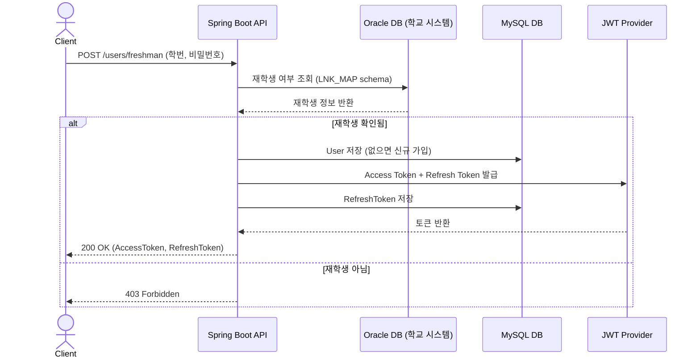
```mermaid
sequenceDiagram
    actor Client
    participant API as Spring Boot API
    participant Oracle as Oracle DB (학교 시스템)
    participant MySQL as MySQL DB
    participant JWT as JWT Provider

    Client->>API: POST /users/freshman (학번, 비밀번호)
    API->>Oracle: 재학생 여부 조회 (LNK_MAP schema)
    Oracle-->>API: 재학생 정보 반환
    alt 재학생 확인됨
        API->>MySQL: User 저장 (없으면 신규 가입)
        API->>JWT: Access Token + Refresh Token 발급
        API->>MySQL: RefreshToken 저장
        JWT-->>API: 토큰 반환
        API-->>Client: 200 OK (AccessToken, RefreshToken)
    else 재학생 아님
        API-->>Client: 403 Forbidden
    end
```

### 5.2 FCM 푸시 알림 흐름 (Outbox 패턴)

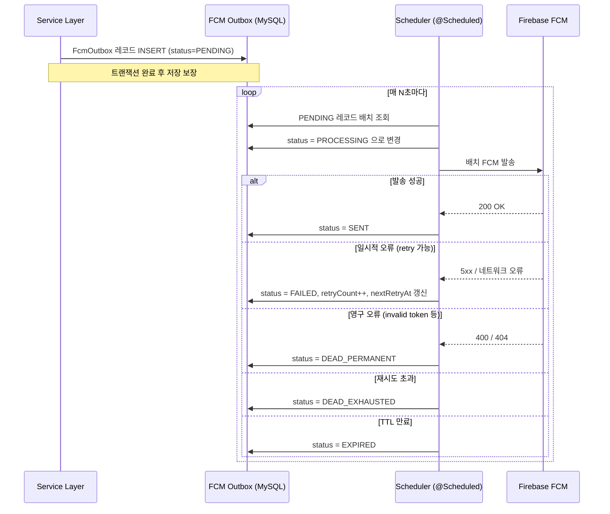
```mermaid
sequenceDiagram
    participant SVC as Service Layer
    participant Outbox as FCM Outbox (MySQL)
    participant Scheduler as Scheduler (@Scheduled)
    participant Firebase as Firebase FCM

    SVC->>Outbox: FcmOutbox 레코드 INSERT (status=PENDING)
    Note over SVC,Outbox: 트랜잭션 완료 후 저장 보장

    loop 매 N초마다
        Scheduler->>Outbox: PENDING 레코드 배치 조회
        Scheduler->>Outbox: status = PROCESSING 으로 변경
        Scheduler->>Firebase: 배치 FCM 발송

        alt 발송 성공
            Firebase-->>Scheduler: 200 OK
            Scheduler->>Outbox: status = SENT
        else 일시적 오류 (retry 가능)
            Firebase-->>Scheduler: 5xx / 네트워크 오류
            Scheduler->>Outbox: status = FAILED, retryCount++, nextRetryAt 갱신
        else 영구 오류 (invalid token 등)
            Firebase-->>Scheduler: 400 / 404
            Scheduler->>Outbox: status = DEAD_PERMANENT
        else 재시도 초과
            Scheduler->>Outbox: status = DEAD_EXHAUSTED
        else TTL 만료
            Scheduler->>Outbox: status = EXPIRED
        end
    end
```

### 5.3 공동구매 채팅 흐름 (WebSocket)

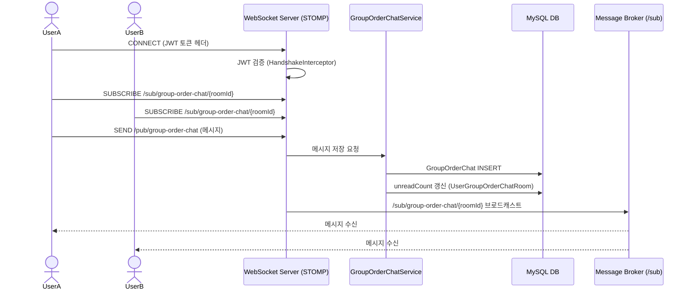
```mermaid
sequenceDiagram
    actor UserA
    actor UserB
    participant WS as WebSocket Server (STOMP)
    participant SVC as GroupOrderChatService
    participant MySQL as MySQL DB
    participant Broker as Message Broker (/sub)

    UserA->>WS: CONNECT (JWT 토큰 헤더)
    WS->>WS: JWT 검증 (HandshakeInterceptor)
    UserA->>WS: SUBSCRIBE /sub/group-order-chat/{roomId}
    UserB->>WS: SUBSCRIBE /sub/group-order-chat/{roomId}

    UserA->>WS: SEND /pub/group-order-chat (메시지)
    WS->>SVC: 메시지 저장 요청
    SVC->>MySQL: GroupOrderChat INSERT
    SVC->>MySQL: unreadCount 갱신 (UserGroupOrderChatRoom)
    WS->>Broker: /sub/group-order-chat/{roomId} 브로드캐스트
    Broker-->>UserA: 메시지 수신
    Broker-->>UserB: 메시지 수신
```

### 5.4 룸메이트 매칭 흐름

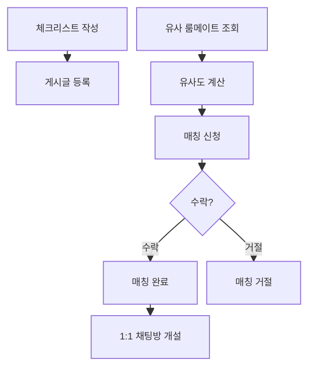
```mermaid
%%{init: {'themeVariables': {'fontSize': '10px'}, 'flowchart': {'nodeSpacing': 10, 'rankSpacing': 12}}}%%
flowchart TD
    A["체크리스트 작성"]
    B["게시글 등록"]
    C["유사 룸메이트 조회"]
    D["유사도 계산"]
    E["매칭 신청"]
    F{"수락?"}
    G["매칭 완료"]
    H["1:1 채팅방 개설"]
    I["매칭 거절"]

    A --> B
    C --> D
    D --> E
    E --> F
    F -->|"수락"| G --> H
    F -->|"거절"| I
```

### 5.5 공지사항 크롤링 흐름

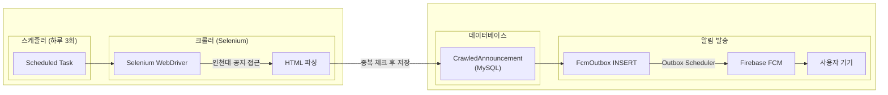
```mermaid
%%{init: {'flowchart': {'defaultRenderer': 'elk'}}}%%
flowchart LR
    subgraph Left["　"]
        direction TB
        subgraph Scheduler["스케줄러 (하루 3회)"]
            TRIGGER["Scheduled Task"]
        end

        subgraph Crawler["크롤러 (Selenium)"]
            SELENIUM["Selenium WebDriver"]
            PARSE["HTML 파싱"]
        end
    end

    subgraph Right["　"]
        direction TB
        subgraph DB["데이터베이스"]
            CRAWLED["CrawledAnnouncement<br/>(MySQL)"]
        end

        subgraph Notify["알림 발송"]
            FCM_OUT["FcmOutbox INSERT"]
            FCM["Firebase FCM"]
            APP["사용자 기기"]
        end
    end

    TRIGGER --> SELENIUM
    SELENIUM -->|"인천대 공지 접근"| PARSE
    PARSE -->|"중복 체크 후 저장"| CRAWLED
    CRAWLED --> FCM_OUT
    FCM_OUT -->|"Outbox Scheduler"| FCM
    FCM --> APP
```

### 5.6 민원 처리 흐름

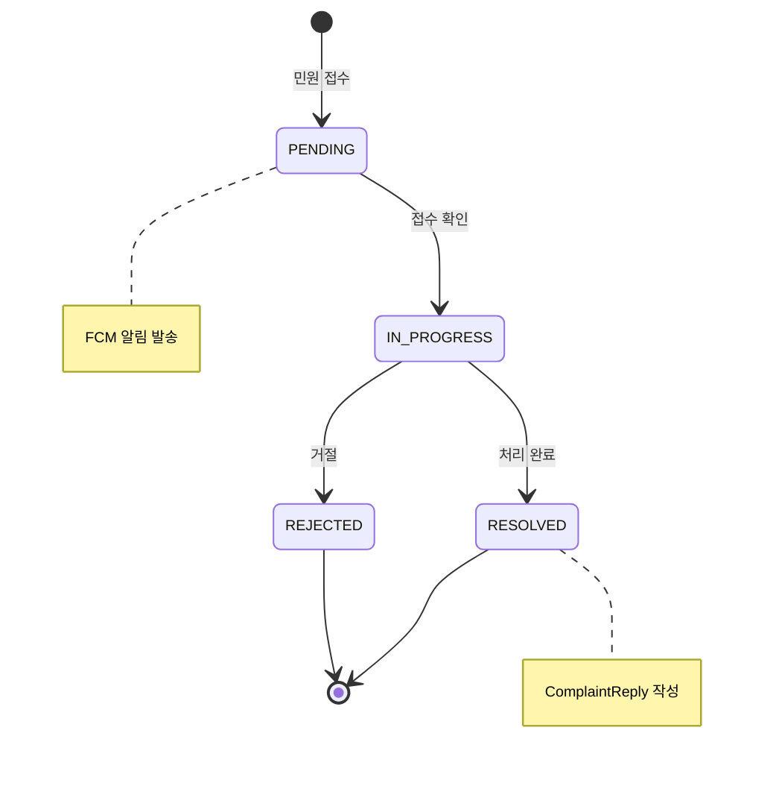
```mermaid
%%{init: {'themeVariables': {'fontSize': '10px'}}}%%
stateDiagram-v2
    [*] --> PENDING: 민원 접수
    PENDING --> IN_PROGRESS: 접수 확인
    IN_PROGRESS --> RESOLVED: 처리 완료
    IN_PROGRESS --> REJECTED: 거절
    RESOLVED --> [*]
    REJECTED --> [*]

    note right of PENDING
        FCM 알림 발송
    end note

    note right of RESOLVED
        ComplaintReply 작성
    end note
```

---

## 6. 인프라 및 배포

### CI/CD 파이프라인

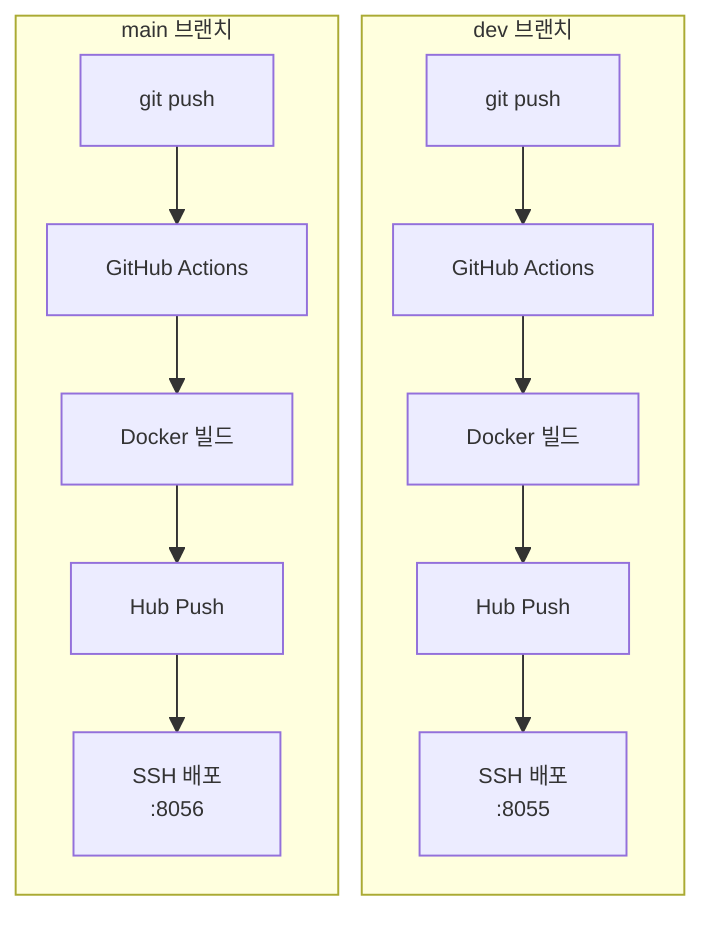
```mermaid
%%{init: {'themeVariables': {'fontSize': '11px'}, 'flowchart': {'nodeSpacing': 12, 'rankSpacing': 15}}}%%
flowchart TB
    subgraph Dev["dev 브랜치"]
        direction TB
        DEV_PUSH["git push"] --> DEV_CI["GitHub Actions"] --> DEV_BUILD["Docker 빌드"] --> DEV_PUSH2["Hub Push"] --> DEV_DEPLOY["SSH 배포<br/>:8055"]
    end

    subgraph Main["main 브랜치"]
        direction TB
        MAIN_PUSH["git push"] --> MAIN_CI["GitHub Actions"] --> MAIN_BUILD["Docker 빌드"] --> MAIN_PUSH2["Hub Push"] --> MAIN_DEPLOY["SSH 배포<br/>:8056"]
    end
```

### 서버 환경 설정

| 항목 | dev | main |
|------|-----|------|
| 포트 | 8055 | 8056 |
| 네트워크 | inu-network | unidorm-network |
| 프로파일 | local | prod |

### 모니터링 스택

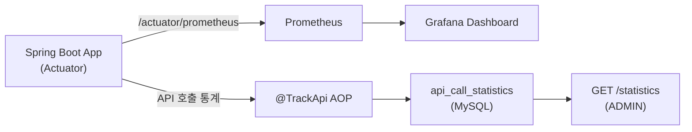
```mermaid
graph LR
    APP["Spring Boot App<br/>(Actuator)"] -->|"/actuator/prometheus"| PROM["Prometheus"]
    PROM --> GRAFANA["Grafana Dashboard"]
    APP -->|"API 호출 통계"| AOP["@TrackApi AOP"]
    AOP --> DB["api_call_statistics<br/>(MySQL)"]
    DB --> STATS["GET /statistics<br/>(ADMIN)"]
```

---

## 7. 주요 성과 및 해결 사례

## 8. 팀원

<table>
  <tbody>
    <tr>
      <td align="center"><a href=""><br /><sub><b>김동현</b></sub></a><br /></td>
      <td align="center"><a href=""><br /><sub><b>김지민</b></sub></a><br /></td>
      <td align="center"><a href="https://github.com/da1nda2n"><br /><sub><b>박다인</b></sub></a><br /></td>
    </tr>
  </tbody>
</table>

---

## 개발 환경 설정

### 필수 요구사항
- Java 17+
- MySQL 8.0+
- Redis 7.0+
- (선택) Oracle DB 연결 정보 (학교 시스템)
- (선택) Firebase ServiceAccountKey

### 로컬 실행

```bash
# QueryDSL Q클래스 생성
./gradlew compileJava

# 빌드 및 실행
./gradlew build
./gradlew bootRun
```

Swagger: `http://localhost:8055/swagger-ui/index.html`

---

| # | 주제 | 문제 | 해결 | 성과 |
|---|------|------|------|------|
| 1 | **FCM 전송 성능 개선** | 1만 건 순차 처리로 알림 16분 지연 | 스레드 증설 대신 `sendEachForMulticast()` 배치 전송 + 청크 크기(30) 최적화 | 전송 시간 97% 단축 (960s → 25s) |
| 2 | **FCM 신뢰성 확보 (Outbox + DLQ)** | 공지 저장·알림 전송 원자성 미보장, 오류 시 알림 유실 | Transactional Outbox 패턴 + 지수 백오프 재시도 + DLQ 복구 체계 구축 | 알림 유실 차단, Outbox 조회 97% 단축 (850ms → 25ms) |
| 3 | **쿠폰 발급 다중 방어** | 매크로 트래픽으로 DB 락 경합 발생, 정상 요청 지연 | Redis Rate Limiting으로 선 차단 + Redis 재고 캐싱으로 DB 접근 최소화 | TPS 83% 향상 (368 → 674), 응답시간 49% 단축 (290ms → 147ms) |
| 4 | **N+1 및 In-Memory Paging 해소** | Fetch Join 시 SQL LIMIT 미작동으로 전체 로드 발생 | QueryDSL 2단계 분리 조회 (ID 선조회 → IN절 매핑) | 쿼리 수 94% 감소 (31회 → 2회), 응답시간 96% 단축 (5.2s → 160ms) |
| 5 | **AI 협업 가이드라인 구축** | 매 세션 컨벤션 재설명으로 토큰 낭비 및 코드 불일치 반복 | `CLAUDE.md` + 15개 커스텀 커맨드로 이슈~PR 전 과정 표준화 | 컨텍스트 재설명 제거, 기능 구현 시간 수 시간 → 1시간 이내 단축 |
